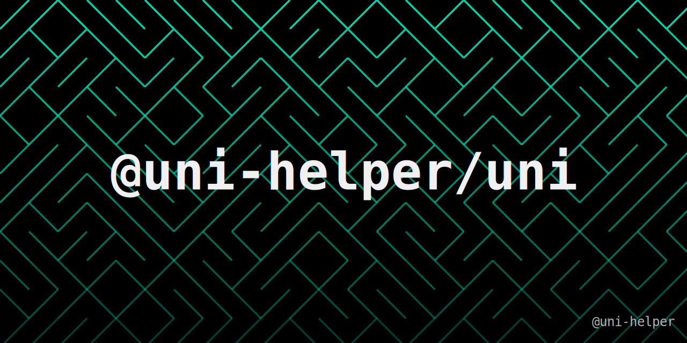

<a href="https://uni-helper.js.org/uni"></a>

<br >
<a href="https://github.com/uni-helper/uni/stargazers"></a>
<a href="https://www.npmjs.com/package/@uni-helper/uni"></a>
<a href="https://www.npmjs.com/package/@uni-helper/uni"></a>

# 由 [uni-helper](https://uni-helper.js.org) 封装的uni命令

## 安装

```bash
pnpm i -D @uni-helper/uni
```

## 使用

📖 **请阅读[完整文档](https://uni-helper.js.org/uni)了解完整使用方法！**

```bash
pnpm dev wx
```

```json
// package.json
{
  "scripts": {
    "dev": "unh dev",
    "build": "unh build",
    "prepare": "unh prepare"
  }
}
```

```ts
// uni.config.ts
import { defineConfig } from '@uni-helper/uni'

export default defineConfig({
  platform: {
    // 默认平台
    default: 'h5',
    // 平台别名
    alias: {
      'h5': ['w', 'h'],
      'mp-weixin': ['wx'],
    },
  },
  prepare: {
    install() {
      console.log('install')
    },
    build(platform: string) {
      console.log('build:', platform)
    },
    dev(platform: string) {
      console.log('dev:', platform)
    },
  },
  autoGenerate: {
    pages: true,
  },
})
```
